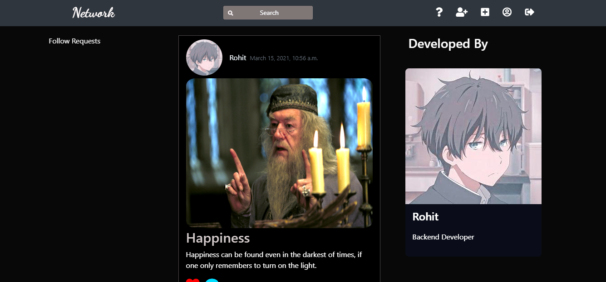

# College Social Network

## Introduction

Hello everyone, my name is Rohit and I am a third year CS student. This is the repository of my 6th sem
minor project which is a college social network. The web app's backend is written completely in django with
a little bit of Ajax for asynchronous works. In the development of this application I am applying the skills
of OOP and RDBMS that i learned in my previous semesters. Also I am learning new skills like Django, Ajax, SQLite, etc to complement my theoretical knowledge. <br>
The motivation for this project is to put up the complete social aspect of my college on the Internet, something which Facebook was initially developed to acheive but failed to do so. I am trying to create a safe refuge for already stressed college students to share their everyday struggles, acheivements, happiness, etc, on a social network without being Guinea pigs for AI algorithms milking them for their attention.

## Features

<ul>
  <li>New Users can register and then subsequently login to their account.</li>
  <br><br>
  
  

<br><br>


<br><br>

  <li>Logged in users can create posts which will be visible to all the users who follow them.</li>
  <br><br>


<br><br>

  <li>Users can also create requests to follow other users.</li>

<br><br>


<br><br>

  <li>Follow requests will be visible on the homepage which can be accepted.</li>
  <br><br>



<br><br>

  <li>Authenticated Users can also like and comment on the posts of other users who have followed them.</li>

<br><br>


<br><br>

  <li>A suggestion link at the navbar provides a list of users to follow.</li>

<br><br>


<br><br>

  <li>A Question and Answer section where authenticated users can ask and answer questions.</li>

<br><br>


<br><br>

</ul>

## Under Development

<ul>
  <li>Two factor face recognition system (Just change the view in minor/urls.py).</li>
  <li>Direct messaging between the users.</li>
  <li>A search bar to search users,questions and posts.</li>
  <li>Tagging Friends in posts, questions, etc.</li>
  <li>Adding nice icons for liking, commenting etc.</li>
  <li>Using ajax to prevent page refresh every time a user likes a post or follow someone</li>
  <li>A better UI aimed at simplifying the application</li>
  <li>Making the face recognition more robust</li>
</ul>

## Installation

<p>Follow these steps to run the web app in your local machine</p>

<ol>
  <li>Make a virtual environment</li>
  <li>Clone the git repo using the command
  
  ``` bash
  git clone https://github.com/RohitRoy741/minor.git
  ```
  </li>
  <li> Move inside the minor directory (the one which contains requirements.txt) </li>
  <li> Install the requirements using pip
  
  ``` bash
  pip install -r requirements.txt
  ```
  </li>
  <li> Run the local server 
  
  ``` bash
  python manage.py runserver
  ```
  </li>
</ol>

## Contribution

<p> Any contribution is welcome, the web app is yet a work in progress. You can do a pull requests however it will better to
open and issue for discussing major changes </p>
